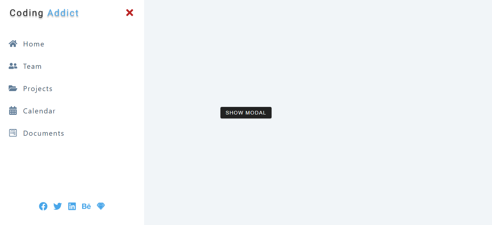

#### Homepage

[view](https://femi-ologunwa.github.io/12-react-sidebar-modal/)

### Implementation

-  Showing how to setup react context.
-  Passing data from context to components.
-  Implement toggle functionality with data received from context
